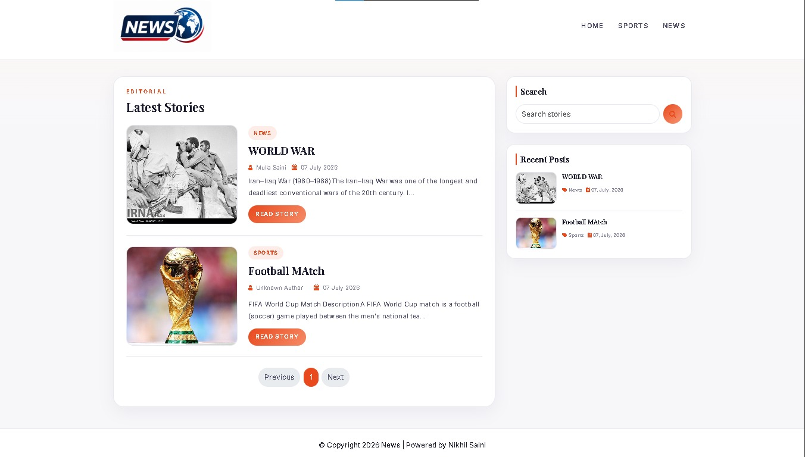
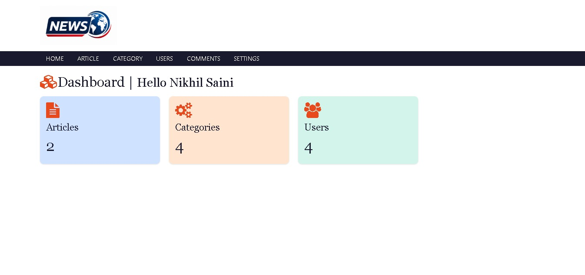
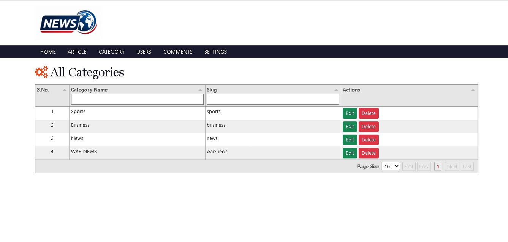

<div align="center">

# 📰 News CMS Project

### A Full-Featured Content Management System for News & Editorial Publishing

[](https://nodejs.org/)
[](https://expressjs.com/)
[](https://www.mongodb.com/)
[](https://ejs.co/)
[](LICENSE)

**A clean, editorial-style News CMS built with Node.js, Express, MongoDB & EJS — featuring a responsive frontend, a powerful admin dashboard, role-based authentication (admin & author), image uploads, WYSIWYG editor, pagination, comment moderation, and full CRUD operations for articles, categories, users, comments, and site settings.**

[Features](#-features) •
[Screenshots](#-screenshots) •
[Tech Stack](#-tech-stack) •
[Getting Started](#-getting-started) •
[Project Structure](#-project-structure) •
[Database Models](#️-database-models) •
[Routes](#️-routes) •
[Contributing](#-contributing)

</div>

---

## ✨ Features

### 🌐 Public Frontend
- **Homepage** — Displays the latest news articles in an editorial card layout with featured images, category badges, author names, and publish dates
- **Single Article Page** — Full article view with rich HTML content, author info, and an approved-comments section with a public comment form
- **Category Filtering** — Browse articles by category (e.g., Sports, Business, News)
- **Author Pages** — View all articles written by a specific author
- **Search** — Regex-based search across article titles and content (case-insensitive)
- **Sidebar Widgets** — Search box and "Recent Posts" widget (latest 5 articles with thumbnails)
- **Dynamic Navigation** — Navbar auto-populates with categories that have published articles
- **Server-Side Pagination** — Paginated article listings (5 per page) for optimal performance
- **Custom Error Pages** — Styled 404 and generic error pages

### 🔐 Authentication & Authorization
- **JWT Cookie Authentication** — Stateless token-based auth with HTTP-only cookies (1-hour expiry) to prevent XSS
- **Password Hashing** — All passwords hashed using `bcryptjs` with 12 salt rounds (pre-save hook)
- **Role-Based Access Control** — Two roles: **Admin** (full access) and **Author** (own articles & comments only)
- **Protected Routes** — `isLoggedIn` middleware for all admin routes; `isAdmin` middleware for admin-only actions
- **Ownership Protection** — Authors can only edit/delete their own articles and see comments on their own articles

### 🛠️ Admin Dashboard
- **Dashboard Overview** — At-a-glance stat cards showing total Articles, Categories, and Users
- **Article Management** — Full CRUD with image upload, category selection, and **Summernote WYSIWYG** rich-text editor
- **Category Management** — Full CRUD with auto-generated slugs; delete protection when category has articles
- **User Management** — Full CRUD with role assignment (admin/author); delete protection when user has articles
- **Comment Moderation** — View, approve, reject, or delete comments via AJAX-powered modal interface
- **Site Settings** — Configure website title, upload custom logo, and set footer description
- **Data Tables** — All admin listings use **Tabulator** with sortable columns, filterable headers, and adjustable page sizes
- **Image Uploads** — `multer`-powered uploads with MIME validation (JPEG/PNG), 5MB size limit, and automatic old-file cleanup

---

## 📸 Screenshots

### Homepage — Latest Stories

> The public-facing homepage displaying the latest articles in an editorial card layout with category badges, author attribution, featured images, "Read Story" buttons, pagination controls, and a sidebar with search and recent posts.



---

### Admin Dashboard

> The admin dashboard greets the logged-in user and provides an at-a-glance overview with color-coded stat cards showing the total count of Articles, Categories, and Users. The top navigation bar provides links to all admin modules.



---

### Admin — Category Management

> The category management page features a Tabulator-powered data table with sortable columns for category names and auto-generated slugs, filterable headers, and quick action buttons for editing and deleting categories.



---

## 🧰 Tech Stack

| Layer | Technology | Purpose |
|---|---|---|
| **Runtime** | Node.js | Server-side JavaScript runtime |
| **Framework** | Express 5.x | Web application framework |
| **Database** | MongoDB + Mongoose 8.x | NoSQL database with ODM |
| **Templating** | EJS + express-ejs-layouts | Server-side HTML rendering with layout support |
| **Authentication** | JSON Web Tokens + bcryptjs | Token-based auth with password hashing |
| **File Uploads** | Multer 2.x | Multipart form-data handling for image uploads |
| **Validation** | express-validator 7.x | Server-side request validation |
| **Pagination** | mongoose-paginate-v2 | Database-level cursor pagination |
| **Rich Text Editor** | Summernote | WYSIWYG editor for article content |
| **Data Tables** | Tabulator | Interactive admin tables with sorting & filtering |
| **URL Slugs** | slugify | SEO-friendly URL slug generation |
| **Sessions** | express-session + connect-flash | Flash messages for user feedback |
| **Environment** | dotenv | Environment variable management |

---

## 🚀 Getting Started

### Prerequisites

Make sure you have the following installed:

- **Node.js** (v18 or higher) — [Download](https://nodejs.org/)
- **MongoDB** (v6 or higher) — [Download](https://www.mongodb.com/try/download/community) or use [MongoDB Atlas](https://www.mongodb.com/atlas)
- **Git** — [Download](https://git-scm.com/)

### Installation

1. **Clone the repository**

   ```bash
   git clone https://github.com/Nikhilsaini223/News-CMS-Project.git
   cd News-CMS-Project
   ```

2. **Install dependencies**

   ```bash
   npm install
   ```

3. **Configure environment variables**

   Create a `.env` file in the project root:

   ```env
   PORT=3000
   MONGODB_URI=mongodb://localhost:27017/news-cms
   JWT_SECRET=your_jwt_secret_key_here
   ```

   | Variable | Description | Required | Default |
   |---|---|---|---|
   | `PORT` | Server port number | No | `3000` |
   | `MONGODB_URI` | MongoDB connection string | **Yes** | — |
   | `JWT_SECRET` | Secret key for JWT token signing & verification | **Yes** | — |

4. **Start the development server**

   ```bash
   npm start
   ```

   > This runs `nodemon app.js` for automatic restarts on file changes during development.

5. **Open in your browser**

   | URL | Description |
   |---|---|
   | `http://localhost:3000` | Public Frontend |
   | `http://localhost:3000/admin` | Admin Login Page |
   | `http://localhost:3000/admin/dashboard` | Admin Dashboard (after login) |

6. **Create your first admin user**

   Navigate to `http://localhost:3000/admin` and register a new account. The first user will need to be manually promoted to `admin` role in MongoDB, or you can register via the admin panel once an admin account exists.

---

## 📁 Project Structure

```
News-CMS-Project/
│
├── app.js                          # Application entry point — Express setup, middleware, DB connection
├── package.json                    # Project metadata, scripts, and dependencies
├── .env                            # Environment variables (not committed to git)
├── .gitignore                      # Git ignore rules
│
├── models/                         # Mongoose database schemas
│   ├── Category.js                 # Category model (name, slug — auto-generated via pre-validate hook)
│   ├── Comment.js                  # Comment model (article ref, name, email, content, status)
│   ├── News.js                     # Article model (title, content, category, author, image — with paginate plugin)
│   ├── Setting.js                  # Site settings model (website_title, website_logo, footer_description)
│   └── User.js                     # User model (fullname, username, password — auto-hashed, role)
│
├── controllers/                    # Business logic for each resource
│   ├── articleController.js        # Article CRUD — create, list, update, delete with image handling
│   ├── categoryController.js       # Category CRUD — with slug generation and delete protection
│   ├── commentController.js        # Comment listing, status updates (approve/reject), and deletion
│   ├── siteController.js           # Frontend pages (home, single, category, search, author, comments)
│   │                               #   + authentication (login, logout) + site settings management
│   └── userController.js           # User CRUD — registration, login, profile management
│
├── routes/                         # Express route definitions
│   ├── admin.js                    # Admin panel routes (/admin/*) with auth & role middleware
│   └── frontend.js                 # Public frontend routes (/*) with common data loading
│
├── middleware/                     # Custom Express middleware
│   ├── isAdmin.js                  # Checks req.role === 'admin', redirects otherwise
│   ├── isLoggedin.js               # Verifies JWT from cookie, sets req.id/role/fullname
│   ├── loadCommonData.js           # Loads settings, latest news, active categories for all frontend views
│   ├── multer.js                   # File upload config — destination, naming, type/size validation
│   └── validation.js               # express-validator rules for login, users, categories, articles
│
├── utils/                          # Helper utilities
│   ├── error-message.js            # createError(message, status) helper
│   └── paginate.js                 # Generic mongoose-paginate-v2 wrapper (default: 5/page, newest first)
│
├── views/                          # EJS templates
│   ├── layout.ejs                  # Frontend layout — dynamic header, nav, sidebar, footer
│   ├── index.ejs                   # Homepage — paginated article listing
│   ├── single.ejs                  # Article detail — full content, comment form, approved comments
│   ├── category.ejs                # Category page — articles filtered by category
│   ├── author.ejs                  # Author page — articles filtered by author
│   ├── search.ejs                  # Search results — regex matched articles
│   ├── 404.ejs                     # 404 Not Found page
│   ├── errors.ejs                  # Generic error page
│   │
│   ├── partials/                   # Reusable frontend template fragments
│   │   ├── header.ejs              # Navigation with dynamic logo & category links
│   │   ├── footer.ejs              # Footer with dynamic description from settings
│   │   ├── sidebar.ejs             # Search box + recent 5 posts with thumbnails
│   │   └── loop.ejs                # Article card component with pagination controls
│   │
│   └── admin/                      # Admin panel templates
│       ├── layout.ejs              # Admin layout — header, nav (role-aware), content injection
│       ├── login.ejs               # Login form (standalone, no layout)
│       ├── dashboard.ejs           # Dashboard — greeting + stat cards
│       ├── articles/
│       │   ├── index.ejs           # Article list — Tabulator table
│       │   ├── create.ejs          # Create article — Summernote editor, image upload
│       │   └── update.ejs          # Edit article — pre-filled form with image preview
│       ├── categories/
│       │   ├── index.ejs           # Category list — Tabulator table
│       │   ├── create.ejs          # Create category form
│       │   └── update.ejs          # Edit category form
│       ├── users/
│       │   ├── index.ejs           # User list — Tabulator table
│       │   ├── create.ejs          # Create user form
│       │   └── update.ejs          # Edit user form
│       ├── comments/
│       │   └── index.ejs           # Comment list — Tabulator table + status modal
│       ├── settings/
│       │   └── index.ejs           # Site settings form
│       ├── 401.ejs                 # Unauthorized error page
│       ├── 404.ejs                 # Not found error page
│       └── 500.ejs                 # Internal server error page
│
├── public/                         # Static assets served by Express
│   ├── css/                        # Stylesheets
│   ├── js/                         # Client-side JavaScript
│   ├── fonts/                      # Custom web fonts
│   ├── images/                     # Static images & logos
│   └── uploads/                    # User-uploaded article images (auto-created)
│
└── screenshots/                    # Project screenshots for README
    ├── Screenshot--1.jpeg          # Homepage view
    ├── Screenshot--2.jpeg          # Admin dashboard
    └── Screenshot--3.jpeg          # Category management
```

---

## 🗄️ Database Models

### 📰 News (Article)

| Field | Type | Constraints | Description |
|---|---|---|---|
| `title` | String | required | Article headline |
| `content` | String | required | Full article body (HTML from Summernote) |
| `category` | ObjectId → Category | required | Reference to the article's category |
| `author` | ObjectId → User | required | Reference to the article's author |
| `image` | String | required | Uploaded image filename |
| `createdAt` | Date | default: `Date.now` | Publish date |

> **Plugin:** `mongoose-paginate-v2` is applied for built-in pagination support.

### 📂 Category

| Field | Type | Constraints | Description |
|---|---|---|---|
| `name` | String | required, unique | Category display name |
| `slug` | String | required, unique | Auto-generated via `slugify` (pre-validate hook) |
| `timestamps` | Date | default: `Date.now` | Creation date |

### 👤 User

| Field | Type | Constraints | Description |
|---|---|---|---|
| `fullname` | String | required | User's display name |
| `username` | String | required, unique | Login username |
| `password` | String | required | Auto-hashed with bcrypt (12 salt rounds, pre-save hook) |
| `role` | String | enum: `author`, `admin` (default: `author`) | Determines access level |

### 💬 Comment

| Field | Type | Constraints | Description |
|---|---|---|---|
| `article` | ObjectId → News | required | Reference to the parent article |
| `name` | String | required | Commenter's display name |
| `email` | String | required | Commenter's email |
| `content` | String | required | Comment body text |
| `status` | String | enum: `pending`, `approved`, `rejected` (default: `pending`) | Moderation status |
| `createdAt` / `updatedAt` | Date | auto (`timestamps: true`) | Auto-managed timestamps |

### ⚙️ Setting

| Field | Type | Constraints | Description |
|---|---|---|---|
| `website_title` | String | required | Site name shown in header/browser tab |
| `website_logo` | String | optional | Path to uploaded logo image |
| `footer_description` | String | required | Text displayed in the site footer |

---

## 🛣️ Routes

### Public Frontend Routes

> All frontend routes use the `loadCommonData` middleware which loads site settings, latest news (for sidebar), and active categories (for navigation).

| Method | Route | Description |
|---|---|---|
| `GET` | `/` | Homepage — paginated latest articles (5/page) |
| `GET` | `/single/:id` | Single article view with approved comments |
| `POST` | `/single/:id/comment` | Submit a comment on an article |
| `GET` | `/category/:name` | Articles filtered by category slug |
| `GET` | `/author/:name` | Articles filtered by author name |
| `GET` | `/search?search=query` | Search articles by keyword (regex) |

### Admin Routes (`/admin/*`)

#### Authentication

| Method | Route | Middleware | Description |
|---|---|---|---|
| `GET` | `/admin/` | — | Login page |
| `POST` | `/admin/index` | loginValidation | Process login (sets JWT cookie) |
| `GET` | `/admin/logout` | isLoggedIn | Logout (clears cookie) |
| `GET` | `/admin/dashboard` | isLoggedIn | Dashboard with stats |

#### Articles (All logged-in users — authors see own articles only)

| Method | Route | Middleware | Description |
|---|---|---|---|
| `GET` | `/admin/article` | isLoggedIn | List articles |
| `GET` | `/admin/add-article` | isLoggedIn | Add article form |
| `POST` | `/admin/add-article` | isLoggedIn, multer, articleValidation | Create article |
| `GET` | `/admin/update-article/:id` | isLoggedIn | Edit article form |
| `POST` | `/admin/update-article/:id` | isLoggedIn, multer, articleValidation | Update article |
| `DELETE` | `/admin/delete-article/:id` | isLoggedIn | Delete article |

#### Categories (Admin only)

| Method | Route | Middleware | Description |
|---|---|---|---|
| `GET` | `/admin/category` | isLoggedIn, isAdmin | List categories |
| `GET` | `/admin/add-category` | isLoggedIn, isAdmin | Add category form |
| `POST` | `/admin/add-category` | isLoggedIn, isAdmin, categoryValidation | Create category |
| `GET` | `/admin/update-category/:id` | isLoggedIn, isAdmin | Edit category form |
| `POST` | `/admin/update-category/:id` | isLoggedIn, isAdmin, categoryValidation | Update category |
| `DELETE` | `/admin/delete-category/:id` | isLoggedIn, isAdmin | Delete category |

#### Users (Admin only)

| Method | Route | Middleware | Description |
|---|---|---|---|
| `GET` | `/admin/users` | isLoggedIn, isAdmin | List users |
| `GET` | `/admin/add-user` | isLoggedIn, isAdmin | Add user form |
| `POST` | `/admin/add-user` | isLoggedIn, isAdmin, userValidation | Create user |
| `GET` | `/admin/update-user/:id` | isLoggedIn, isAdmin | Edit user form |
| `POST` | `/admin/update-user/:id` | isLoggedIn, isAdmin, userUpdateValidation | Update user |
| `DELETE` | `/admin/delete-user/:id` | isLoggedIn, isAdmin | Delete user |

#### Comments (All logged-in users — authors see comments on own articles only)

| Method | Route | Middleware | Description |
|---|---|---|---|
| `GET` | `/admin/comments` | isLoggedIn | List comments |
| `PUT` | `/admin/update-comment-status/:id` | isLoggedIn | Update comment status (approve/reject) |
| `DELETE` | `/admin/delete-comment/:id` | isLoggedIn | Delete comment |

#### Site Settings (Admin only)

| Method | Route | Middleware | Description |
|---|---|---|---|
| `GET` | `/admin/settings` | isLoggedIn, isAdmin | Settings form |
| `POST` | `/admin/save-settings` | isLoggedIn, isAdmin, multer | Save settings |

---

## 🔒 Security

| Feature | Implementation |
|---|---|
| **Authentication** | JWT tokens stored in HTTP-only cookies (1-hour expiry) |
| **Password Storage** | bcrypt hashing with 12 salt rounds (pre-save Mongoose hook) |
| **Role Authorization** | `isAdmin` middleware restricts admin-only routes |
| **Ownership Check** | Authors can only manage their own articles/comments |
| **Input Validation** | `express-validator` with detailed rules (length, uniqueness, format) |
| **Upload Security** | MIME type validation (JPEG/PNG only), 5MB file size limit |
| **Env Secrets** | DB URI and JWT secret stored in `.env`, excluded via `.gitignore` |

---

## 🎨 Design System

The frontend follows a warm, editorial design language:

| Token | Value | Usage |
|---|---|---|
| **Accent** | `#E8491D` | Primary brand color, buttons, category badges |
| **Accent Hover** | `#c73c15` | Interactive hover states |
| **Ink** | `#1a1a2e` | Primary text color |
| **Ground** | `#f7f7fa` | Page background |
| **Gradient** | `#E8491D → #f4845f → #f6b093` | Decorative accents |
| **Headline Font** | Playfair Display | Article titles, section headers |
| **Body Font** | Inter | UI elements, body text, navigation |

---

## 📋 Validation Rules

All form inputs are validated server-side using `express-validator`:

| Form | Field | Rules |
|---|---|---|
| **Login** | username | 5–12 characters, no spaces |
| | password | 5–12 characters |
| **User (Create)** | fullname | 5–25 characters |
| | username | 5–12 characters, no spaces, unique |
| | password | 5–12 characters |
| | role | `author` or `admin` |
| **User (Update)** | password | Optional; if provided, 5–12 characters |
| **Category** | name | 3–12 characters, unique (excludes current record on update) |
| **Article** | title | 7–50 characters |
| | content | Minimum 50 characters |
| | category | Required |
| | image | Required on create; optional on update |

---

## 🤝 Contributing

Contributions are welcome! Here's how to get started:

1. **Fork** the repository
2. **Create a feature branch**
   ```bash
   git checkout -b feature/your-feature-name
   ```
3. **Commit your changes**
   ```bash
   git commit -m "feat: add your feature description"
   ```
4. **Push** to your fork
   ```bash
   git push origin feature/your-feature-name
   ```
5. **Open a Pull Request** against `main` with a clear description and test steps

### Guidelines

- Follow the existing code structure and naming conventions
- Write meaningful commit messages following [Conventional Commits](https://www.conventionalcommits.org/)
- Test all CRUD operations and edge cases before submitting
- Update this README if your changes affect configuration or routes

---

## 📄 License

This project is licensed under the **ISC License**.

---

## 👤 Author

**Nikhil Saini**

- GitHub: [@Nikhilsaini223](https://github.com/Nikhilsaini223)

---

<div align="center">

**⭐ If you found this project helpful, please give it a star! ⭐**

Made with ❤️ by Nikhil Saini

</div>
